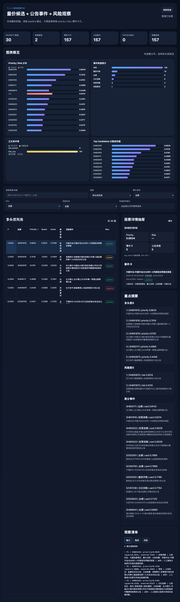

# PersonalQuant

PersonalQuant 是一个面向个人研究场景的 A 股投研操作台。它不是自动交易系统，也不是一个过度包装的量化框架；它更像一个稳定、可复盘、可扩展的研究后台：先用量价做初筛，再用公告事件做再排序，最后把结果整理成适合人工复核的候选池、事件卡片和观察清单。



## What this project produces

当前 1.0 版本聚焦 4 个稳定输出：

1. 每周候选池 Top 30
2. 候选股最近 7 天公告事件卡片
3. 每日 / 每周 / 风险观察清单
4. 本地可视化前端仪表盘
5. 前向验证 / 历史评估 / 批次 diff / 单票时间线
6. wangji-scanner 14日形态扫描器（strict / relax）

如果你想先看“跑出来到底长什么样”，先看：

- `docs/sample_outputs.md`：样例输出说明
- `docs/environment_setup.md`：环境准备说明
- `docs/pattern_14d_breakout_pullback_spec.md`：14日整理-放量突破-缩量回踩 形态规则说明书

## Why it exists

很多个人投研流程的问题不是“没模型”，而是：

- 候选池太散，无法快速收敛
- 公告阅读成本太高
- 催化与风险混在一起，优先级不清晰
- 每次跑出来的结果不能回溯，难以复盘

PersonalQuant 当前的思路是：

- 量价层负责“先收窄范围”
- 公告事件层负责“再提炼优先级”
- watchlist 负责“把结果变成人能直接执行的动作清单”
- archive 负责“把每次输出留下来，给后续时间线与复盘做基础”

## End-to-end workflow

```text
Qlib 历史样本训练
        ↓
AkShare live CSI300 候选打分
        ↓
Top30 候选池
        ↓
抓最近 7 天公告 + PDF 正文摘录 / 标题回退
        ↓
事件卡片生成（importance / bias / confidence / summary）
        ↓
priority_score / risk_attention_score 双榜
        ↓
Daily / Weekly / Risk Watchlists
        ↓
Dashboard 浏览 + 历史归档
```

## Architecture

```text
                    ┌───────────────────────────┐
                    │     config/config.yaml    │
                    └─────────────┬─────────────┘
                                  │
             ┌────────────────────┼────────────────────┐
             │                    │                    │
             ▼                    ▼                    ▼
┌────────────────────┐  ┌────────────────────┐  ┌────────────────────┐
│ qlib_pipeline.py   │  │ announcements.py   │  │ summarizer.py      │
│ - train baseline   │  │ - fetch notices    │  │ - classify events  │
│ - score candidates │  │ - extract PDF text │  │ - build summaries  │
└─────────┬──────────┘  └─────────┬──────────┘  └─────────┬──────────┘
          │                       │                       │
          └──────────────┬────────┴──────────────┬────────┘
                         ▼                       ▼
                 ┌──────────────────────────────────────┐
                 │            priority.py               │
                 │ - event_score                        │
                 │ - priority_score                     │
                 │ - risk_attention_score               │
                 └─────────────────┬────────────────────┘
                                   │
                     ┌─────────────┼─────────────┐
                     ▼             ▼             ▼
          ┌────────────────┐ ┌──────────────┐ ┌──────────────────┐
          │ watchlist.py   │ │ dashboard.py │ │ io_utils.py       │
          │ - daily/weekly │ │ - json snap  │ │ - archives/latest │
          │ - risk list    │ │ - ui payload │ │ - batch snapshots │
          └────────┬───────┘ └──────┬───────┘ └────────┬─────────┘
                   │                │                  │
                   ▼                ▼                  ▼
          data/outputs/*     frontend/*         data/archives/*
```

## Current capabilities

### Quant layer
- 用 Qlib 历史样本训练量价 baseline
- 用 AkShare 拉取当前沪深 300 成分股最近行情并实时打分
- 默认候选生成模式：`live_akshare`
- 当前 baseline 已升级为 v1.1 特征增强版，包含：
  - 1/5/10/20 日动量
  - 5/10/20 日均线结构及偏离率
  - 5/10/20 日量能结构及偏离率
  - 5/20 日波动率
  - intraday / overnight 因子
  - 20 日价格位置
  - 20 日成交量 z-score

### Event layer
- 对候选池抓最近 7 天公告
- 优先尝试 PDF 正文摘录，失败自动回退 `title_only`
- 已加入正文质量评分与低质量回退，避免乱码 / 空正文污染排序
- 事件层会输出：
  - `card_score`
  - `risk_card_score`
  - `event_score`
  - `priority_score`
  - `risk_attention_score`

### Output layer
- `priority_candidates.csv`
- `risk_candidates.csv`
- `event_cards.json`
- `daily_watchlist.md`
- `weekly_watchlist.md`
- `risk_watchlist.md`
- `dashboard_data.json`
- `strategy_validation_summary.json`
- `strategy_validation_report.md`
- `backtest_summary.json`
- `backtest_summary.md`
- `archive_diff.json`
- `archive_diff.md`
- `data/validation/validation_records.csv`
- `data/outputs/timelines/*.md`
- `data/archives/run_YYYYMMDD_HHMMSS/`

## Scoring logic

当前排序不是只靠单一 quant score，而是双层结构：

```text
priority_score       = 0.55 * quant_score_norm + 0.45 * event_score
risk_attention_score = 0.80 * risk_event_score + 0.20 * quant_score_norm
```

设计意图：
- priority 用来回答“今天先看谁”
- risk 用来回答“哪些票需要优先做负面复核”

## Repository layout

```text
config/                  配置文件
src/ashare_platform/     后端核心模块
scripts/                 可直接运行的脚本
frontend/                本地静态前端
notebooks/               研究预留目录
docs/                    文档、样例、扩展说明
  assets/                README/文档图片资源
data/
  announcements/         公告样本 / 输入
  factors/               预留因子目录
  outputs/               当前批次输出（默认忽略）
  processed/             处理中间产物（默认忽略）
  archives/              历史归档（默认忽略）
logs/                    运行日志（默认忽略）
```

## Environment

推荐运行环境：

- macOS Apple Silicon
- Python 3.11
- 已验证可用的 Qlib 虚拟环境：`~/.venvs/qlib`

最快启动方式：

```bash
source ~/.venvs/qlib-activate.sh
python -V
python -c "import qlib, akshare, lightgbm, pandas; print('env ok')"
```

如果你需要自行安装依赖：

```bash
python3.11 -m venv .venv
source .venv/bin/activate
python -m pip install --upgrade pip setuptools wheel
pip install -r requirements.txt
```

更完整的环境说明见：`docs/environment_setup.md`

## Quickstart

```bash
cd /Users/ryan/.hermes/hermes-agent/projects/a_share_research_platform
source ~/.venvs/qlib-activate.sh
python scripts/run_weekly_pipeline.py
python scripts/serve_dashboard.py
```

打开：

```text
http://127.0.0.1:8765
```

## Developer-friendly entrypoints

仓库现在补了几样更顺手的工程入口：

- `scripts/dev.py`：统一 CLI 入口
- `Makefile`：对常用 CLI 命令做更短的包装
- `config/config.sample.yaml`
- `.github/ISSUE_TEMPLATE/*`
- `.github/pull_request_template.md`

推荐直接用统一 CLI：

```bash
python scripts/dev.py --help
python scripts/dev.py init-config
python scripts/dev.py smoke
python scripts/dev.py run
python scripts/dev.py dashboard
python scripts/dev.py validate
python scripts/dev.py backtest
python scripts/dev.py archive-diff
python scripts/dev.py timeline SH600875 --limit 5
python scripts/dev.py wangji-scanner
python scripts/dev.py cron-run
python scripts/dev.py serve --port 8765
python scripts/dev.py clean-pyc
```

如果你更喜欢短命令，也可以继续用 Makefile：

```bash
make help
make init-config
make smoke
make run
make dashboard
make wangji-scanner
make cron-run
make serve PORT=8765
```

如果你想使用自定义配置而不是默认 `config/config.yaml`：

```bash
python scripts/dev.py --config config/config.local.yaml run
make run CONFIG=config/config.local.yaml
```

底层通过环境变量：

```text
PERSONALQUANT_CONFIG=/path/to/config.yaml
```

来切换配置文件。

## Common commands

### 1) 运行完整主流程

```bash
python scripts/run_weekly_pipeline.py
```

默认会完成：
- Qlib 训练与打分
- Top30 候选池生成
- 公告抓取与正文抽取
- 事件卡片生成
- priority / risk 候选池生成
- watchlist 输出
- forward validation 快照 / 回填 / 报告
- historical backtest 评估摘要
- archive diff
- top priority 时间线文件
- dashboard 数据快照生成
- 当前批次归档

### 2) 单独重建 dashboard 数据

```bash
python scripts/build_dashboard_data.py
```

### 3) 启动本地 dashboard

```bash
python scripts/serve_dashboard.py
```

## Frontend

当前前端是纯静态页面，不依赖 React / Vue，直接读取 `data/outputs/dashboard_data.json`。

支持：
- 多头优先池浏览
- 风险观察池浏览
- 事件卡片浏览
- 股票详情聚合
- 搜索与基础筛选
- 运行与验证概览卡片
- strategy validation / backtest / archive diff 报告切换
- recent_archives 数据展示
- 单票时间线展示

## wangji-scanner

你刚刚定义的 14 日形态规则，已经做成了一个独立扫描器：

- `wangji-scanner`

入口：

```bash
python scripts/dev.py wangji-scanner
# 或
python scripts/run_wangji_scanner.py
```

兼容旧别名：

```bash
python scripts/dev.py wangji-sacnner
python scripts/run_wangji_sacnner.py
```

输出文件：
- `data/outputs/wangji-scanner_strict_candidates.csv`
- `data/outputs/wangji-scanner_strict_report.md`
- `data/outputs/wangji-scanner_relax_candidates.csv`
- `data/outputs/wangji-scanner_relax_report.md`
- `data/outputs/wangji-scanner_summary.json`

前端现在也新增了“初筛板块”，同时展示：
- 模型初筛结果
- wangji-scanner 结果
- wangji-scanner 内部 strict / relax tab 切换

当前规则包含：
- 周线 MA5 > MA13 > MA21
- 周线均线整体向上
- 日线前10日窄幅整理
- 第11日放量突破
- 第12-14日缩量回踩

## Scheduled workflow / cron

完整定时入口现在是：

```bash
bash scripts/run_cron_workflow.sh
```

它会：
- 激活 `~/.venvs/qlib-activate.sh`
- 执行完整 pipeline
- 刷新 validation / backtest / archive diff / timelines / dashboard data
- 把运行日志写入 `logs/cron/`

建议默认计划：

```cron
35 8 * * 1-5
```

这样工作日早上会自动生成一轮新的研究快照。

更完整说明见：`docs/cron_workflow.md`

## CI

仓库内置最小 smoke CI：

- 安装 `requirements.txt`
- `python -m compileall src scripts`
- import smoke test

对应文件：`.github/workflows/smoke.yml`

## Current limitations

- 默认 `llm.provider=mock`，事件摘要和分类仍以规则版为主
- 东方财富 PDF 正文抽取偶尔会出现空正文或低质量文本，当前已做安全回退
- 当前重点是“量价初筛 + 公告事件再排序”，不是高频策略或自动交易系统
- 当前更重视解释性与流程稳定性，而不是追求复杂模型堆叠

## Roadmap

### Near-term
- [ ] 公告正文多源兜底
- [ ] 单票事件时间线与历史批次对比
- [ ] 事件分类器继续提纯
- [ ] 说明会 / 调研纪要 与真实业绩催化进一步区分

### Mid-term
- [ ] 横截面排序评估（rank IC / 分组回测）
- [ ] 相对强弱 / 行业超额收益因子
- [ ] 历史批次对比页
- [ ] 单票研究档案页

### Optional
- [ ] 更强的 LLM 事件卡片生成链路
- [ ] 更轻量的一键运行脚本 / Makefile
- [ ] 更完整的 sample config / sample outputs bundle

## Key files

- 配置：`config/config.yaml`
- 周度主流程：`scripts/run_weekly_pipeline.py`
- 公告处理：`src/ashare_platform/announcements.py`
- 事件摘要：`src/ashare_platform/summarizer.py`
- 排序逻辑：`src/ashare_platform/priority.py`
- 仪表盘数据：`src/ashare_platform/dashboard.py`
- 样例输出说明：`docs/sample_outputs.md`

## License

MIT License
